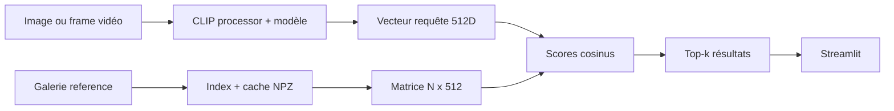
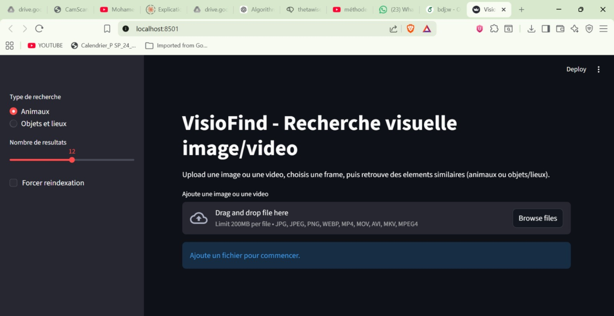
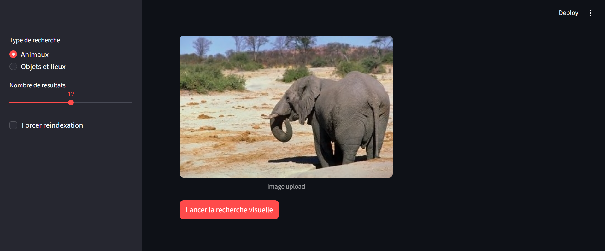
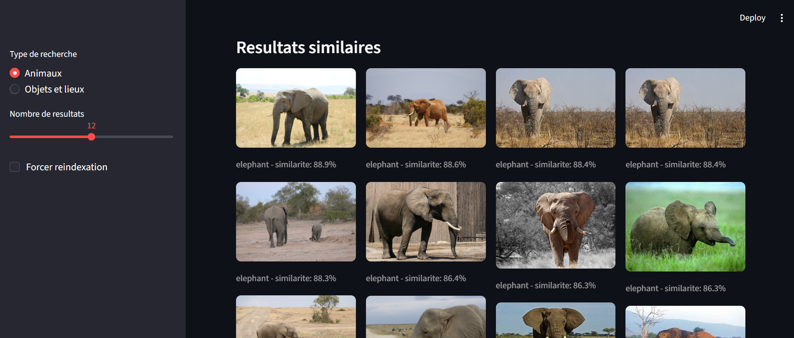
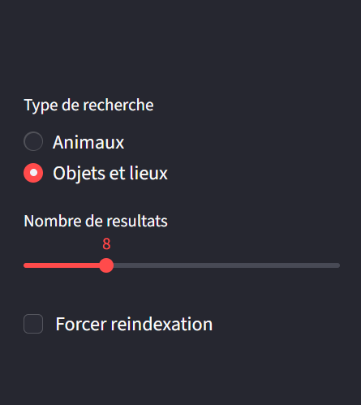
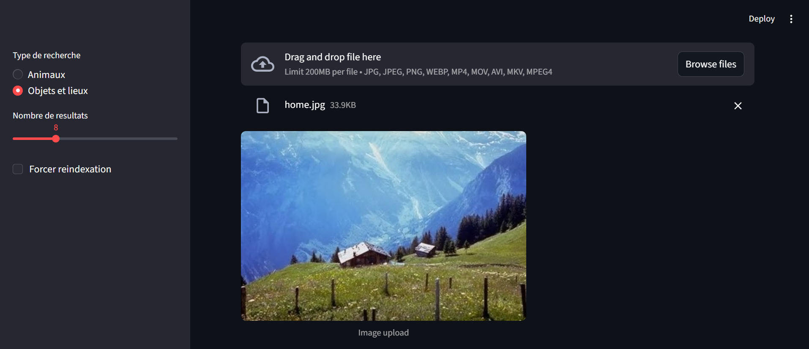
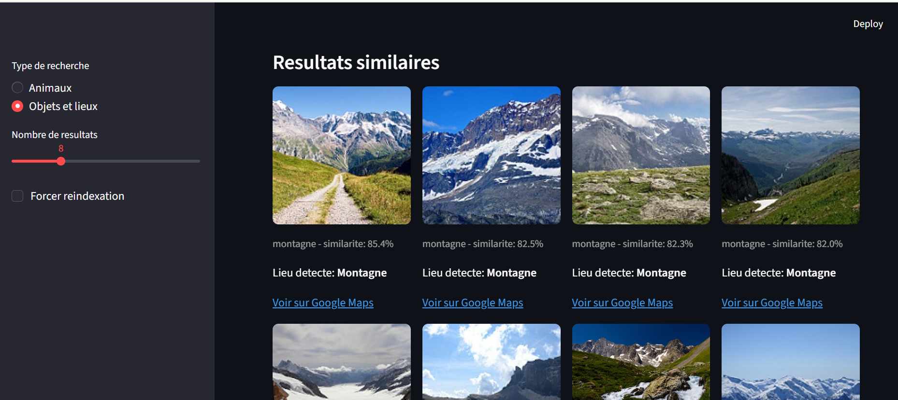
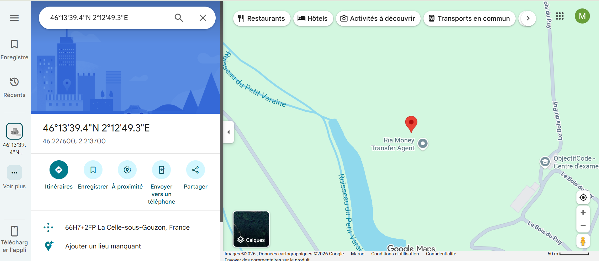

# Rapport de projet — VisioFind

**Titre :** système de recherche visuelle par similarité (image et vidéo) basé sur l’apprentissage profond (CLIP).

**Public :** évaluation académique — présentation détaillée pour le professeur (chaque étape, technologies, limites et perspectives).

**Auteurs :** *(à compléter : noms des étudiants et encadrant)*

---

## Table des matières

1. [Résumé exécutif](#1-résumé-exécutif)
2. [Introduction et objectifs](#2-introduction-et-objectifs)
3. [Intérêt du deep learning et du traitement d’image dans la vie réelle](#3-intérêt-du-deep-learning-et-du-traitement-dimage-dans-la-vie-réelle)
4. [Technologies, bibliothèques et modèle utilisés](#4-technologies-bibliothèques-et-modèle-utilisés)
5. [Jeux de données : pré-entraînement du modèle vs galerie du projet](#5-jeux-de-données-pré-entraînement-du-modèle-vs-galerie-du-projet)
6. [Architecture et fonctionnement du pipeline](#6-architecture-et-fonctionnement-du-pipeline)
7. [Fonctionnalités détaillées : modes, cartes (Maps) et vidéo](#7-fonctionnalités-détaillées--modes-cartes-maps-et-vidéo)
8. [Utilité concrète et usage au quotidien](#8-utilité-concrète-et-usage-au-quotidien)
9. [Exécution du projet avec captures d’écran](#9-exécution-du-projet-avec-captures-décran)
10. [Axes de développement futurs](#10-axes-de-développement-futurs)
11. [Contraintes, difficultés et limites](#11-contraintes-difficultés-et-limites)
12. [Conclusion](#12-conclusion)
13. [Références et sources](#13-références-et-sources)

---

## 1. Résumé exécutif

**VisioFind** est une application web (Streamlit) qui permet à l’utilisateur de **téléverser une image ou une vidéo**, d’en extraire éventuellement **une image-clé (frame)**, puis de **retrouver les images les plus visuellement proches** dans une galerie locale organisée en deux univers : **animaux** et **objets / lieux**. Le moteur de similarité repose sur le modèle **CLIP** (`openai/clip-vit-base-patch32`), **pré-entraîné** et utilisé ici sans ré-entraînement : chaque image est convertie en un **vecteur de 512 dimensions** ; la proximité se mesure par le **cosinus** entre le vecteur de la requête et ceux de la galerie. Le mode **objets et lieux** peut afficher un **lien Google Maps** lorsque l’étiquette du résultat correspond à un lieu configuré dans le code. L’objectif pédagogique est de montrer une chaîne complète : **données → index vectoriel → interface → recherche par le contenu** (*content-based image retrieval*, CBIR).

---

## 2. Introduction et objectifs

### 2.1 Problématique

La recherche d’images par **mots-clés** suppose que l’utilisateur sait **nommer** ce qu’il cherche. Or, en pratique, on a souvent une **photo** ou une **scène vidéo** sans vocabulaire précis, ou des synonymes / langues différentes. La **recherche par le contenu visuel** compare directement des **représentations apprises** des images, ce qui contourne en partie ces limites.

### 2.2 Objectifs du projet

- Proposer une interface **interactive** et **pédagogique** pour la recherche visuelle.
- Gérer **image** et **vidéo**, avec **choix explicite d’une frame** après extraction (contrôle utilisateur).
- Séparer **deux galeries** (`animaux` / `objets_lieux`) pour des résultats plus cohérents par domaine.
- **Accélérer** les lancements suivants grâce à un **cache d’index** sur disque (fichiers `.npz`).
- Enrichir le mode lieux avec des **métadonnées** et un accès **cartographique** pour certaines classes.

### 2.3 Étapes logiques vues par l’utilisateur

1. Choisir le **type de recherche** dans la barre latérale.
2. **Téléverser** un fichier image ou vidéo.
3. Si vidéo : **sélectionner une frame** parmi celles extraites.
4. Lancer la **recherche** : calcul (ou rechargement) de l’index, encodage de la requête, tri des meilleures correspondances.
5. **Consulter** la grille de résultats (scores, étiquettes) et, le cas échéant, **ouvrir Google Maps**.

---

## 3. Intérêt du deep learning et du traitement d’image dans la vie réelle

### 3.1 Traitement d’image

Le **traitement d’image** classique couvre la lecture des formats, les **espaces colorimétriques** (ici passage en RGB), le **redimensionnement**, parfois le filtrage ou la segmentation. Dans VisioFind, une grande partie du **prétraitement « compatible modèle »** est assurée par le **processeur CLIP** (normalisation, taille d’entrée attendue par le réseau). Pour la **vidéo**, on ajoute la **décodage** et l’**échantillonnage temporel** (extraction de frames à intervalle régulier) via **OpenCV**.

### 3.2 Deep learning

Le **deep learning** fournit des **descripteurs de haut niveau** : au lieu de comparer des pixels ou des histogrammes simples, on compare des **embeddings** produits par un **réseau profond** entraîné sur d’immenses volumes de données. **CLIP** apprend un espace où **images et textes** sont alignés par **contraste** ; dans ce projet, on exploite surtout la **branche image** pour mesurer la **similarité visuelle** entre la requête et la galerie.

### 3.3 Pourquoi c’est important « dans la vraie vie »

Des idées proches existent dans : la **recherche d’images** sur téléphone, la **modération** ou le **catalogage** automatique, l’**e-commerce** (« trouver un article visuellement proche »), la **sécurité** (recherche de scènes similaires), la **médecine** (images à l’appui, sous contraintes réglementaires), ou encore l’**archivage** de collections photo/vidéo. VisioFind en est une **démonstration réductible** : galerie locale, pas de cloud obligatoire, code lisible pour un cours de vision ou d’IA.

---

## 4. Technologies, bibliothèques et modèle utilisés

### 4.1 Langage et exécution

- **Python 3** (typage, `pathlib`).
- Environnement virtuel recommandé (`.venv`) pour isoler les versions.

### 4.2 Bibliothèques principales (fichier `requirements.txt`)

| Bibliothèque | Rôle dans VisioFind |
|--------------|---------------------|
| **streamlit** | Interface web : sidebar, upload, boutons, affichage des images et liens ; cache `@st.cache_resource` pour l’index. |
| **torch**, **torchvision** | Inférence PyTorch du modèle CLIP (`eval`, pas de gradient en recherche). |
| **transformers** (Hugging Face) | Chargement de `CLIPModel` et `CLIPProcessor`, appels à `get_image_features`. |
| **Pillow** | Ouverture des images, conversion RGB. |
| **opencv-python** | Lecture vidéo, écriture des frames extraites. |
| **numpy** | Matrice d’embeddings, produits scalaires, tri, sauvegarde `.npz`. |
| **ddgs**, **icrawler**, **requests** | Scripts de constitution du dataset (recherche web / repli Bing). |
| **tqdm** | Barres de progression dans les scripts. |
| **kaggle** | Téléchargement alternatif de jeux de données via l’API Kaggle. |
| **pandas** | Présent dans les dépendances pour d’éventuels scripts ou analyses ; le cœur `src/` peut fonctionner sans l’utiliser directement pour la recherche. |

### 4.3 Modèle de deep learning

- **Nom Hugging Face :** `openai/clip-vit-base-patch32`.
- **Type :** Vision Transformer (ViT) côté image, avec patchs 32×32 (d’où « patch32 »), combiné à un encodeur texte en entraînement d’origine ; ici **seule l’encodeur image** sert aux embeddings.
- **Dimension des vecteurs :** **512** (normalisés en **L2** pour que le produit scalaire corresponde au **cosinus**).
- **Poids :** **gelés** — pas d’entraînement supplémentaire dans ce dépôt ; la qualité dépend du modèle public et de la **richesse** de la galerie locale.

---

## 5. Jeux de données : pré-entraînement du modèle vs galerie du projet

### 5.1 Données de pré-entraînement (CLIP — contexte)

Le modèle **CLIP** d’OpenAI a été entraîné sur un très grand nombre de **paires image–texte** issues du Web (filtrage, contraste image/texte). Ce **pré-entraînement** n’est pas rejoué dans le projet : les poids sont **téléchargés** depuis Hugging Face au premier usage. **Pourquoi utiliser un modèle pré-entraîné ?** Cela évite des semaines de calcul et des téraoctets de données tout en offrant déjà un **espace sémantique–visuel** utile pour la similarité.

### 5.2 Galerie de référence du projet (`data/reference/`)

Ce n’est **pas** le jeu d’entraînement de CLIP : c’est le **corpus sur lequel on cherche** (CBIR). Il est organisé ainsi :

- `data/reference/animaux/<nom_classe>/` — images par espèce ou famille.
- `data/reference/objets_lieux/<nom_classe>/` — objets, scènes, lieux.

L’**étiquette affichée** est le **nom du dossier parent** : organisation **supervisée par la structure des fichiers**, sans classifieur entraîné localement sur ces labels.

### 5.3 Comment cette galerie est alimentée (sources)

- **Script web** (`scripts/build_dataset.py`) : **DuckDuckGo** (`ddgs`), avec **repli Bing** (`icrawler`) si le réseau bloque DuckDuckGo.
- **Script Kaggle** (`scripts/build_dataset_kaggle.py`) : alternative **fiable** quand le web est instable ; nécessite `kaggle.json` (voir `scripts/check_kaggle_auth.py`).
- **Ajout manuel** : copie d’images dans les bons sous-dossiers.

**Remarque éthique et juridique :** les images téléchargées automatiquement peuvent être soumises à **droits d’auteur** et **conditions d’usage** ; pour un rapport ou une démo institutionnelle, il faut le **mentionner** et privilégier des sources autorisées ou des jeux **libres** lorsque c’est possible.

---

## 6. Architecture et fonctionnement du pipeline

### 6.1 Fichiers clés

| Fichier | Rôle |
|---------|------|
| `app.py` | Streamlit : modes, upload, vidéo/frames, bouton de recherche, affichage résultats + Maps. |
| `src/embeddings.py` | Chargement CLIP, carré noir pour padding, `embed_images`, normalisation L2. |
| `src/index_store.py` | Parcours récursif des images, construction d’index, cache `.npz`, `search_similar`. |
| `src/media.py` | `extract_video_frames` : une frame tous les *N* images, plafond de frames. |
| `src/places.py` | Dictionnaire `KNOWN_PLACES` : étiquette → latitude, longitude, nom affiché ; génération du lien Maps. |

### 6.2 Schéma logique

### 6.3 Recherche

Pour chaque requête, on calcule le **produit scalaire** entre le vecteur normalisé de la requête et **tous** les vecteurs de l’index (complexité **O(N)** en nombre d’images). Pour des dizaines de milliers d’images ou plus, des structures du type **FAISS** pourraient être envisagées (hors périmètre actuel).

---

## 7. Fonctionnalités détaillées : modes, cartes (Maps) et vidéo

### 7.1 Deux modes : animaux et objets / lieux

- **Animaux** : la galerie ne contient que des classes animales → résultats **homogènes** pour ce thème.
- **Objets et lieux** : objets du quotidien et scènes (rue, plage, etc.) → utile pour des **contextes variés** et pour la démo **Maps** lorsque l’étiquette correspond à une entrée de `KNOWN_PLACES`.

### 7.2 Idée des cartes (Google Maps)

Lorsqu’un résultat a une étiquette présente dans `src/places.py` (ex. `plage`, `rue_urbaine`, `montagne`, `parc`, `restaurant`), l’interface affiche **« Lieu détecté »** et un lien **« Voir sur Google Maps »** pointant vers des **coordonnées représentatives** associées à cette classe. Ce n’est pas une **géolocalisation GPS** de la photo de l’utilisateur : c’est une **mise en contexte** pédagogique et une **passerelle** vers la carte pour illustrer le type de lieu retrouvé. Les coordonnées peuvent être **affinées** ou étendues à de vrais POI dans une version ultérieure.

### 7.3 Pourquoi l’option vidéo ?

Une vidéo contient **plusieurs instants** ; une seule image pourrait être **non représentative** (flou, cadrage raté, objet hors champ). VisioFind **extrait un ensemble de frames** (paramètres : tous les 15 frames, max 24 images dans `src/media.py`) puis laisse l’utilisateur **choisir la frame** à analyser. Ainsi, on peut **« chercher l’image à l’instant qui compte »** : principe utile pour les **vidéos touristiques**, **tutoriels**, **surveillance amateur** ou tout contenu où **le moment** change le sens visuel. Cela rapproche le prototype d’outils réels de **navigation par keyframes** dans les archives vidéo.

---

## 8. Utilité concrète et usage au quotidien

- **Tri et exploration de photos personnelles** : « trouver des clichés ressemblant à cette scène ».
- **Éducation** : illustrer CBIR, embeddings, cache, sans entraîner un gros modèle.
- **Prototype e-commerce ou musée** : recherche « par l’exemple » dans un catalogue fixe.
- **Sensibilisation** : limites des modèles généralistes, biais des données, besoin de corpus de qualité.

---

## 9. Exécution du projet avec captures d’écran

### 9.1 Prérequis et lancement

1. Créer un environnement virtuel et installer les dépendances : `pip install -r requirements.txt`.
2. (Recommandé) Construire la galerie : par exemple `python scripts/build_dataset.py --preset extended --per-class 120`.
3. Lancer l’application : `streamlit run app.py` ou `python -m streamlit run app.py` sous Windows si besoin.

Les captures suivantes se trouvent dans le dossier du projet :  
`docs/screenshots/`

---

### 9.2 Scénario A — Mode **Animaux**

#### Figure A1 — Barre latérale : mode Animaux et paramètres de recherche

Capture : choix du mode **Animaux**, réglage du nombre de résultats (top-*k*) et option de réindexation.

#### Figure A2 — Étape d’upload : image de requête téléversée

Capture : fichier image chargé, aperçu avant lancement de la recherche par similarité.

#### Figure A3 — Résultats : images similaires dans la galerie animaux

Capture : grille des meilleures correspondances avec **scores de similarité (%)** et **noms de classes** (noms des dossiers sous `data/reference/animaux/`).

---

### 9.3 Scénario B — Mode **Objets et lieux** (résultats + Google Maps)

#### Figure B1 — Barre latérale : mode Objets et lieux

Capture : bascule vers le mode **Objets et lieux** pour interroger la seconde galerie.

#### Figure B2 — Étape d’upload : scène / lieu ou objet

Capture : image de requête représentative d’un lieu ou d’une scène avant recherche.

#### Figure B3 — Résultats : grille d’images similaires (scores et étiquettes)

Capture : affichage des voisins visuels dans `objets_lieux` ; les étiquettes proviennent des noms de dossiers.

#### Figure B4 — Intégration Google Maps pour une classe de lieu connue

Capture : détail ou vue où apparaissent **« Lieu détecté »** et le lien **« Voir sur Google Maps »** (métadonnées définies dans `src/places.py` pour les étiquettes configurées).

---

## 10. Axes de développement futurs

- **Fine-tuning** ou modèle spécialisé (domaine médical, industriel, etc.) pour de meilleures distinctions fines.
- **Index approximatif** (FAISS, ScaNN) et **quantification** des vecteurs pour de très grandes galeries.
- **Segmentation / détection** : encoder une **région** (objet découpé) plutôt que toute l’image.
- **Métadonnées riches** : multi-labels, EXIF, vraie géolocalisation si disponible.
- **API REST** ou conteneur **Docker** pour déploiement.
- **Évaluation quantitative** : protocole de requêtes annotées, précision@*k*.
- **Amélioration vidéo** : plus de frames, aperçu temporel, ou résumé automatique de scènes.

---

## 11. Contraintes, difficultés et limites

### 11.1 Contraintes rencontrées (retour d’expérience)

- **Réseau** : indisponibilité ou blocage de DuckDuckGo → stratégie de **repli** (Bing / `icrawler`) ou usage **Kaggle**.
- **Authentification Kaggle** : fichier `kaggle.json` mal placé ou renommé en `.txt` sous Windows.
- **API Transformers** : évolutions du type de retour de `get_image_features` → code compatible **tensor** ou **objet avec `pooler_output`**.
- **Fichiers corrompus** : extensions valides mais contenu illisible → ignorés à l’indexation avec avertissement.
- **Streamlit sous Windows** : commande `streamlit` absente si le venv n’est pas activé → `python -m streamlit`.

### 11.2 Limites liées au matériel

- **CPU** : premier lancement long (téléchargement des poids CLIP, construction d’index sur un gros corpus).
- **RAM / disque** : un **dataset très volumineux** augmente le temps d’indexation et la taille des `.npz` ; le scan linéaire O(N) devient plus coûteux.
- **GPU** : non indispensable pour la démo mais **réduirait la latence** d’encodage batch à grande échelle.

### 11.3 Limites liées au dataset « trop grand » ou « mal équilibré »

- Trop d’images : indexation et recherche plus lentes sans optimisation (FAISS, etc.).
- Déséquilibre entre classes : certaines classes **dominent** les résultats par simple abondance.
- Qualité hétérogène des images web : bruit, watermarks, étiquettes dossier ≠ contenu réel.

### 11.4 Limites du modèle gelé

- **Confusions** possibles entre espèces ou scènes proches visuellement sans entraînement spécifique.
- **Biais** hérités des données massives d’entraînement de CLIP.

### 11.5 Limites fonctionnelles actuelles

- Pas de **segmentation** : similarité sur l’**image entière**.
- **Vidéo** : échantillonnage simple, pas d’analyse sémantique temporelle poussée.
- **Maps** : coordonnées **symboliques** par classe, pas géolocalisation image par image.

---

## 12. Conclusion

VisioFind synthétise une chaîne **moderne** de recherche d’images : **traitement d’image** (formats, vidéo), **deep learning** (CLIP pré-entraîné), **index vectoriel** avec **cache**, et **interface** Streamlit. Les deux modes **animaux** et **objets/lieux** structurent l’expérience utilisateur ; l’option **vidéo** avec choix de frame répond au besoin de **s’arrêter sur l’instant pertinent** ; le lien **Google Maps** illustre la **valeur ajoutée des métadonnées** pour les lieux. Le projet met aussi en lumière les **contraintes réelles** : collecte de données, matériel, taille du corpus, et limites des modèles généralistes. Il constitue une **base solide** pour des prolongements (indexation rapide, fine-tuning, géolocalisation réelle, API), tout en restant **compréhensible** dans un cadre pédagogique de vision par ordinateur et d’IA.

---

## 13. Références et sources

- Radford et al., *Learning Transferable Visual Models From Natural Language Supervision* (CLIP), 2021 — [https://arxiv.org/abs/2103.00020](https://arxiv.org/abs/2103.00020)
- Modèle Hugging Face : [https://huggingface.co/openai/clip-vit-base-patch32](https://huggingface.co/openai/clip-vit-base-patch32)
- Documentation **Streamlit** : [https://streamlit.io/](https://streamlit.io/)
- **PyTorch** : [https://pytorch.org/](https://pytorch.org/)
- **Transformers** (Hugging Face) : [https://huggingface.co/docs/transformers](https://huggingface.co/docs/transformers)
- Constitution du dataset : scripts `build_dataset.py`, `build_dataset_kaggle.py` ; API **Kaggle** : [https://www.kaggle.com/docs/api](https://www.kaggle.com/docs/api)

---

*Fin du rapport — projet VisioFind (`docs/rapport_visiofind.md`). Pour une version PDF, compiler depuis `docs/rapport_visiofind.tex` ou exporter ce Markdown (Pandoc, etc.).*
